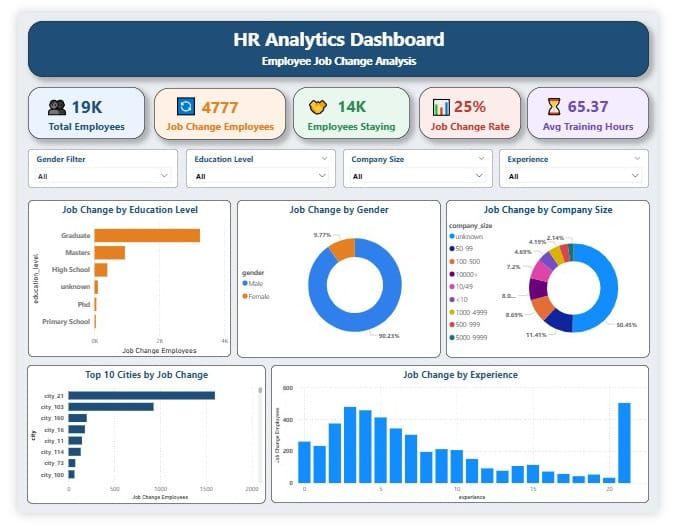

# HR Analytics Dashboard

An interactive **HR Analytics Dashboard** built using **Power BI** to analyze employee job change patterns, workforce demographics, education levels, company size, experience, and training hours.

The dashboard helps HR teams understand which employee groups are more likely to change jobs and supports better workforce planning and employee retention decisions.

---

## 📌 Project Overview

Employee attrition and job changes are important HR challenges. This project analyzes employee data to identify patterns related to job change behavior.

The dashboard provides a clear overview of employee job change trends based on:

- Education level
- Gender
- Company size
- Experience
- City
- Training hours

---

## 🎯 Project Objectives

- Analyze the total number of employees.
- Identify the number of employees who changed jobs.
- Calculate the job change rate.
- Compare job changes across education levels.
- Analyze job changes by gender.
- Identify top cities with the highest job changes.
- Understand the relationship between employee experience and job change.
- Analyze job changes across different company sizes.
- Track average training hours of employees.

---

## 📊 Dashboard KPIs

| KPI | Value |
|---|---:|
| Total Employees | 19K |
| Job Change Employees | 4,777 |
| Employees Staying | 14K |
| Job Change Rate | 25% |
| Average Training Hours | 65.37 |

---

## 📈 Dashboard Visualizations

### 1. Job Change by Education Level
This chart shows the number of employees who changed jobs based on their education level. Graduates have the highest number of job changes compared to other education groups.

### 2. Job Change by Gender
This donut chart compares job change employees across gender categories and helps understand gender-wise workforce movement.

### 3. Job Change by Company Size
This chart shows how job changes are distributed across companies of different sizes. It helps identify whether employees from smaller or larger companies are more likely to change jobs.

### 4. Top 10 Cities by Job Change
This bar chart highlights the top 10 cities with the highest number of employees changing jobs.

### 5. Job Change by Experience
This chart analyzes employee job change trends based on years of experience. It helps identify experience groups with higher job change activity.

---

## 🛠️ Tools and Technologies Used

- **Power BI** – Dashboard creation and data visualization
- **Power Query** – Data cleaning and transformation
- **Microsoft Excel / CSV** – Dataset source
- **GitHub** – Project documentation and version control

---

## 🧹 Data Cleaning and Preparation

The following steps were performed during data preparation:

- Checked and handled missing values.
- Cleaned column names for better readability.
- Converted data types where required.
- Created calculated fields for employee job change analysis.
- Organized employee data for dashboard visualizations.
- Created filters for Gender, Education Level, Company Size, and Experience.

---

## 🔍 Key Insights

- Around **25% of employees** changed their jobs.
- Graduates represent the highest number of employees changing jobs.
- Employee job change behavior varies based on years of experience.
- Certain cities have significantly higher job change counts.
- Company size plays an important role in employee job change patterns.
- Training hours can be monitored along with employee movement for HR planning.

---

## 🎛️ Dashboard Filters

The dashboard includes interactive slicers for:

- Gender
- Education Level
- Company Size
- Experience

These filters allow users to explore employee job change trends for specific groups.

---

## 🖼️ Dashboard Preview




---

## 📁 Project Files

```text
hr-analytics-dashboard/
│
├── HR_Analytics_Dashboard.pbix
├── dashboard_preview.png
├── hr_employee_data.csv
└── README.md
